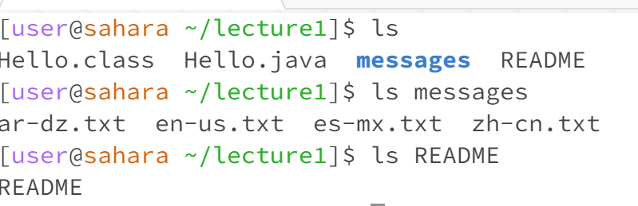
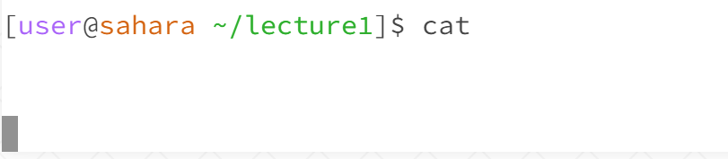
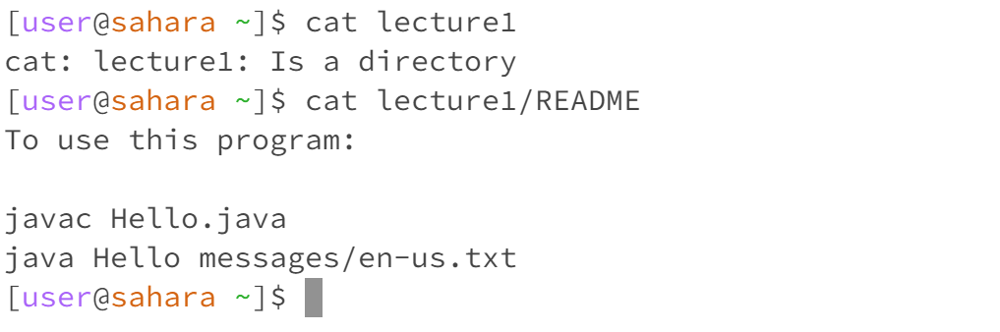

# Lab Report 1 - Remote Access and FileSystem (Week 1) {#week-1-lab-report}

## cd:

> no argument: cd means change directory, when there is no argument, it goes back to the home directory.
> ---
> directory argument: it switches to the given working directory, in this case which is "lecture1"
> ---
> File argument: Since we are putting a file as an argument, it result in an error message mentioning that it is not a directory.
>---
## ls: 

> no argument: it lists all the files/folders inside lecture1 (since the current working directory is Lecture1). Notice that "messages" is displayed with color which indicates that it is a folder.
> ---
> directory argument: it lists all the text documents inside the directory "messages" when we make it an argument. We observe that there are four separate text documents that represents different languages.
> ---
> File argument: Since README is the only file we want to list, it print out the argument itself because it is the only file in the given path.
> ---

## cat: 

> no argument: there is no content to print (since there is no given argument), therefore it result in an error and exit the program.
> ---

> directory argument: it print out that lecture1 "Is a directory". This shows that the cat command can't print out the content inside a directory calling it through an argument, inside it will printout an message to the user
> to redirect the argument input.
> ---
> File argument: given the path lecture1/README, it printout the content inside the README file, which is a text file that contains the imformation about how to use the program Hello.java. 
> ---
