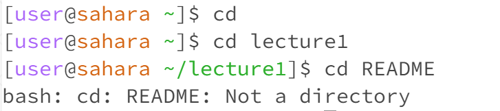

# Lab Report 1 - Remote Access and FileSystem (Week 1) {#week-1-lab-report}

## cd:

> no argument: cd means change directory, when there is no argument, it goes back to the home directory `/home`.

> directory argument: it switches to the given working directory, in this case, the working directory is just `/home`, and since `lecture1` is an existing file in the working directory, the current working directory is changed to `/home/lecture1`.

> File argument: Since `README` is a file, it results in an error message mentioning that it is not a directory if we put it as an argument.

## ls: 

> no argument: It lists all the files/folders inside the `lecture1` directory. (since the current working directory is `/home/lecture1)`. Notice that `messages` is displayed with color which indicates that it is a folder.

> directory argument: Since the current working directory is `/home/lecture1`, when we put `message` as the argument, it can access all the text documents inside the directory `messages` when we make it an argument (since it is inside the `/lecure1` directory. We observe that four separate text documents represent different languages.

> File argument: Since `README` is the only file we want to list, it prints out the argument itself because it is the only file in the given path.

## cat: 

> no argument: The system enters into an infinite loop while it is still running. When we type an input, it will respond with the same output. In this case, I enter in " "(space), which it responds with " " (space). We can exit the infinite loop through Ctrl+C.

> directory argument: With the working directory as `/home` it prints out that `lecture1` "Is a directory". This shows that the cat command can't print out the content inside a directory by calling it through an argument, it will print out a message to the user to redirect the argument input.

> File argument: given the path  `lecture1/README`, with the working directory `/home`, 
we can access and print out the content inside the `README` file, which is a text file that contains information about how to use the program `Hello.java`. 
