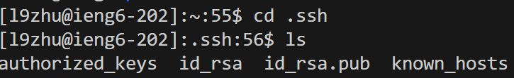

# Lab Report 2
## Part 1

Which methods in your code are called?

* The handleRequest method of the Handler class is called, with the argument of `new URI("https://localhost;4000/add-message?s=hello&user=Luna")`

What are the relevant arguments to those methods, and the values of any relevant fields of the class?
The relevant arguments and values are: 
* url: The argument passed to the handlRequest method.
* query: The query part of the URI obtained using `url.getQuery()`.
* message: "Extracted from the query using `query.split("&")[0].split("=")[1]`."
* user: Extracted from `query.split("=")[2]`.
* displayText: The field in the 'Handler'class that stores the formatted user and message.

How do the values of any relevant fields of the class change from this specific request? If no values got changed, explain why.

With the input `/add-message?s=hello&user=Luna`: 

* `query`: "s=hello&user=Luna"
* `message`: "hello"
* `user`: "Luna"
* `displayText`: "Luna : hello\n"

Which methods in your code are called?

* Same as the code above, The `handleRequest` method of the Handler class is called, but this time with the argument `new URI("https://localhost;4000/add-message?s=This is the Second Message&user=Student2")`.

What are the relevant arguments to those methods, and the values of any relevant fields of the class?

The relevant arguments and values are also the same as above: 
* url, query, message, user, displayText.

How do the values of any relevant fields of the class change from this specific request? If no values got changed, explain why.

With the input `/add-message?s=This is the Second Message&user=Student2`: 

* `query`:  "s=This is the Second Message&user=Student2"
* `message`: "This is the Second Message"
* `user`: "Student2"
* _Since the new message added to the collection of preivous messages_ `displayText`: 
"Luna : hello\nStudent2 : This is the Second Message\n"

## Part 2
### The absolute path to the private key

* The absolute path should be `/home/zhulu/.ssh/id_rsa`

### The absolute path to the public key

* The absolute path should be `/home/l9zhu@ieng6-202/.ssh/authorized_keys`

### login without password

## Part 3

In labs we had on weeks 2 and 3 I learned a lot about using Java on website url and connecting to a port of a server. Not only that I'm able to recognize more commands such as ssh, mkdir, scp...etc. I also gained a greater understanding of the concept behind those files, servers, and URLs that I used or saw every day. Additionally, I became more familiar with the process of working on GitHub and vscode, which is beneficial for both my in-class or outside class programming developments.
