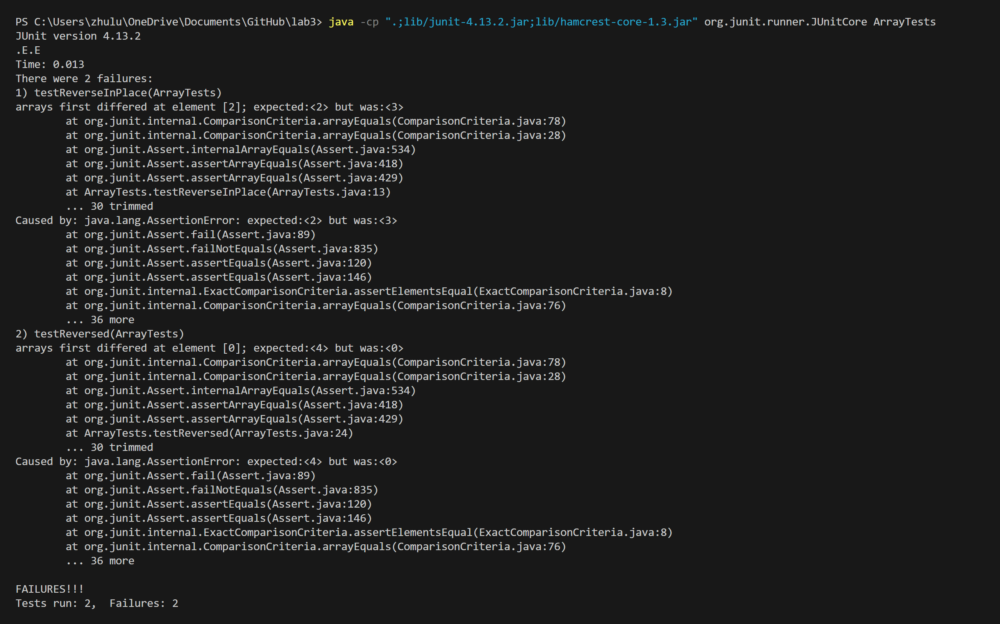
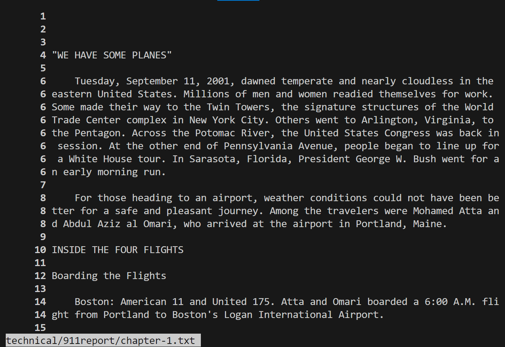
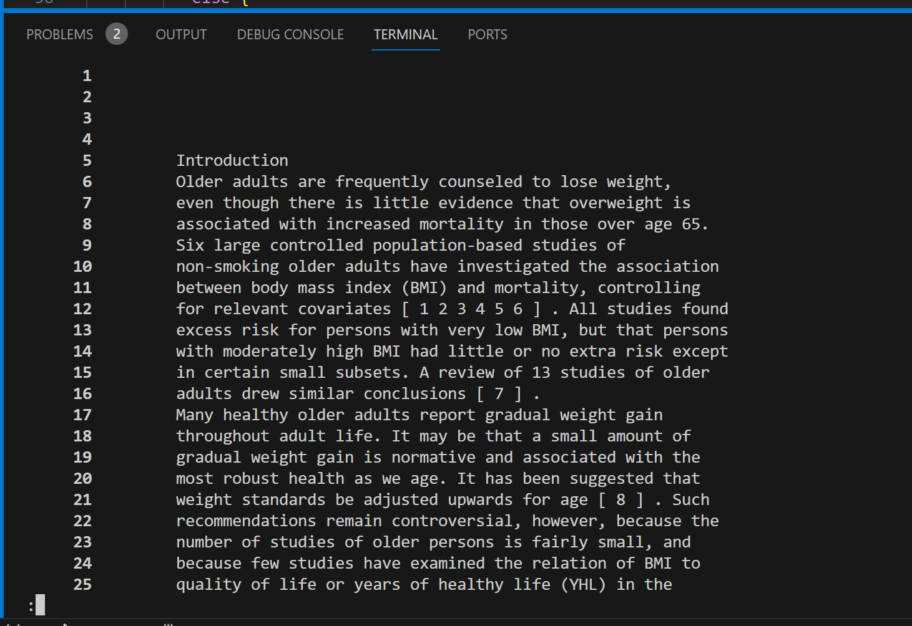
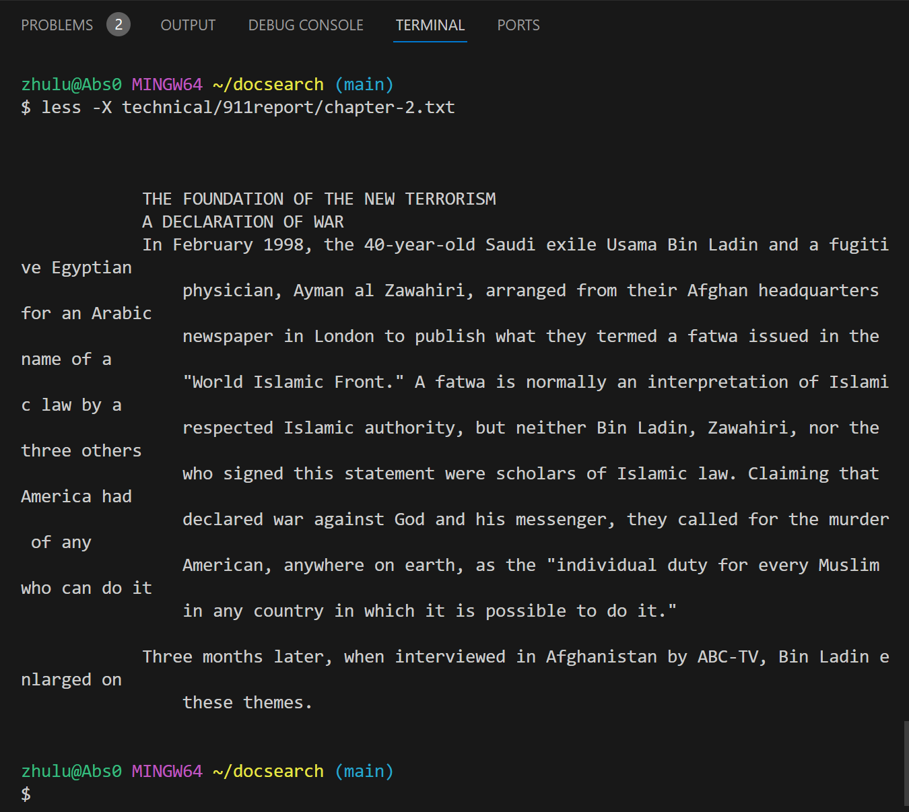
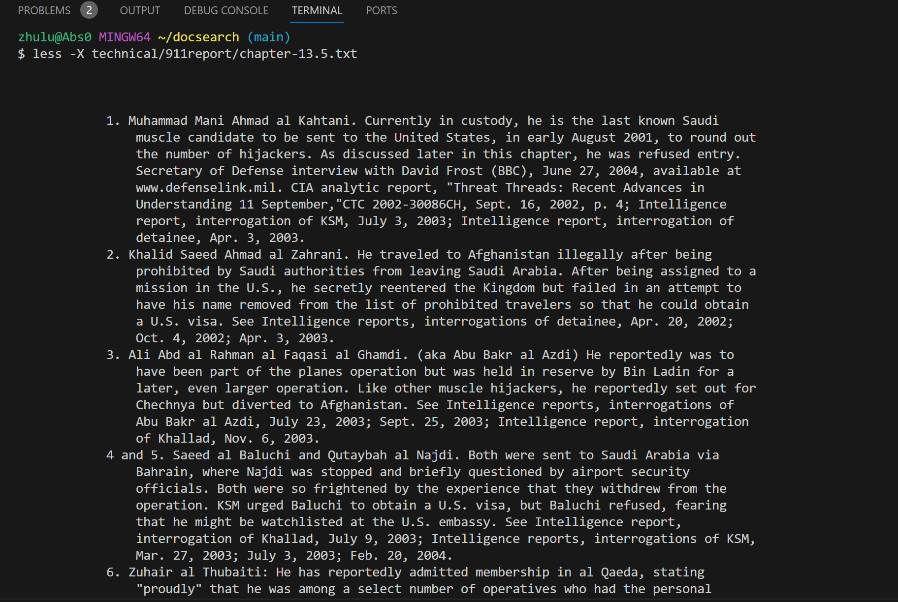
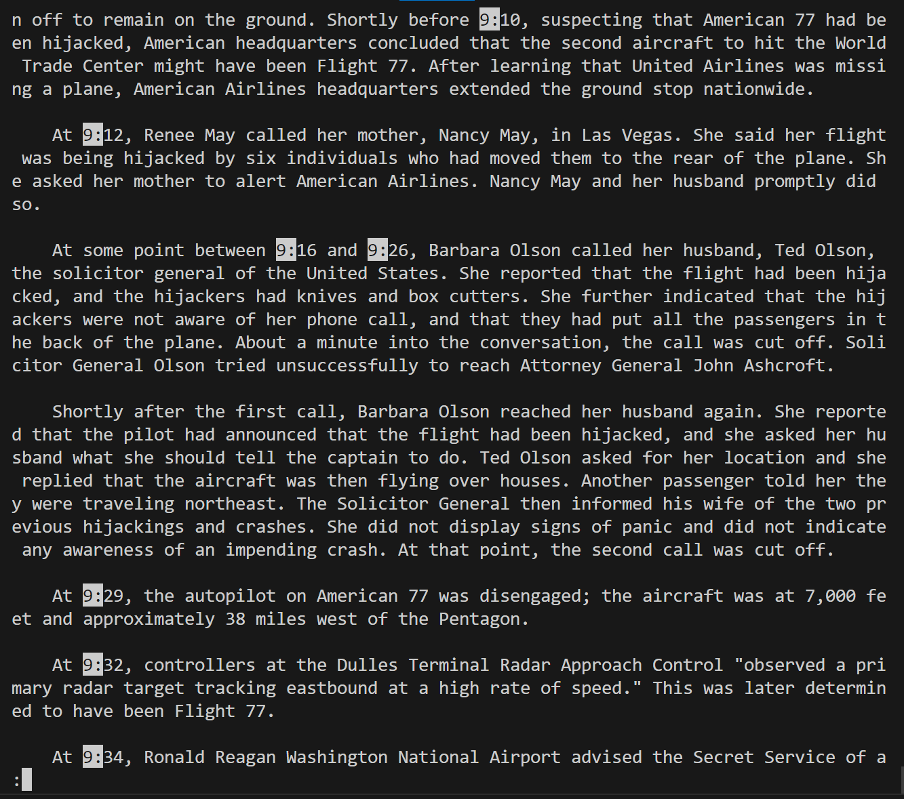
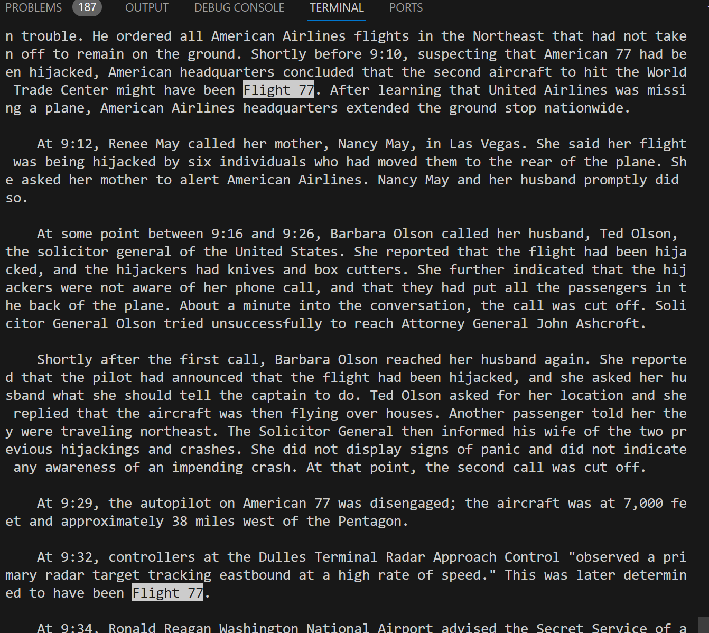
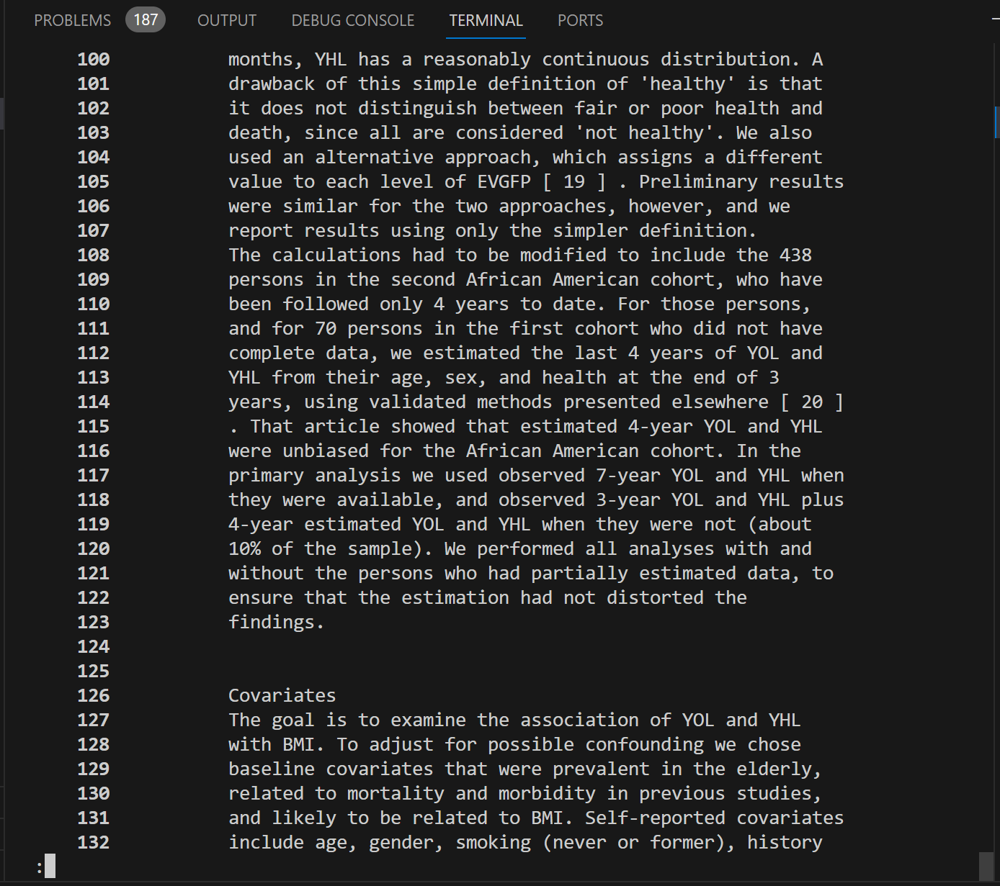
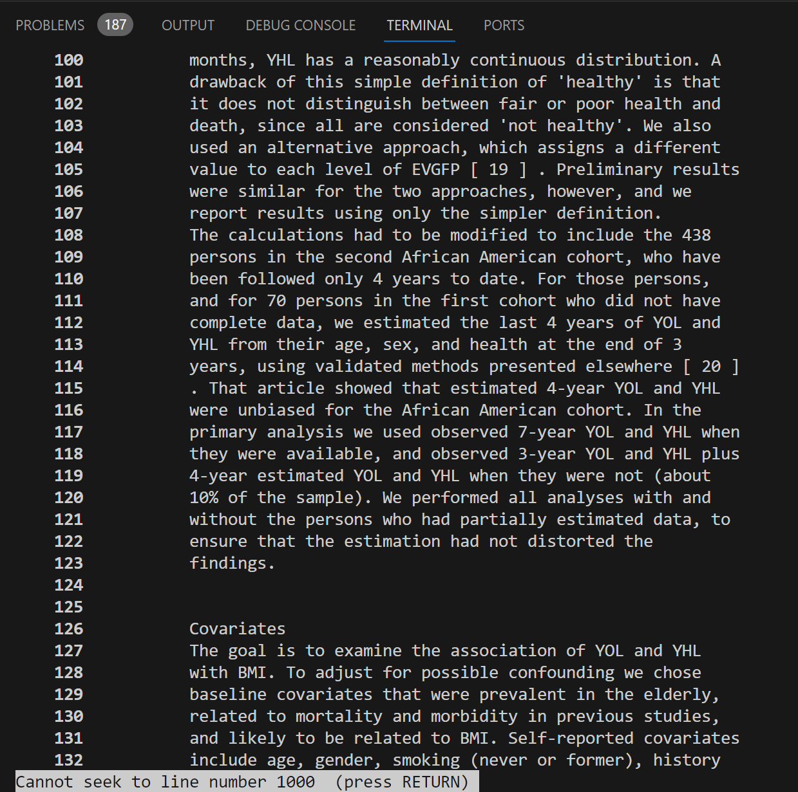

# Lab Report 3
## Part 1-Bugs

### reversedInPlace

1. An input that induces a failure:   
```
int[] input1 = { 1, 2, 3, 4};
ArrayExamples.reverseInPlace(input2);  
assertArrayEquals(new int[]{ 4, 3, 2, 1 }, input2);
``` 

2. An input that doesn't induce a failure
 
```
int[] input1 = { 3 };
ArrayExamples.reverseInPlace(input1);  
assertArrayEquals(new int[]{ 3 }, input1);
```

3. The symptom


4. The bug

before: 
```
 static void reverseInPlace(int[] arr) {
    for(int i = 0; i < arr.length; i += 1) {
      arr[i] = arr[arr.length - i - 1];
    }
  }
```

after:
```
  static void reverseInPlace(int[] arr) {
    for(int i = 0; i < arr.length/2; i += 1) {
      int num = arr[i];
      arr[i] = arr[arr.length - i - 1];
      arr[arr.length - i - 1] = num;
    }
  }

```
> In the test inputs, we observe the symptom as the code would only work on non-symmetric arrays with lengths less than or equal to 1, and fails for all the others. As we look into the code, the reverseInPlace method only iterates halfway through the array, and then the second half is unexpectedly overridden by the new data. Therefore we can make a temporary int variable `temp` to hold the other half of the data and place it into the right position as the array gets iterated through.

## Part 2-Researching Commands

### 4-interesting command-line options/alternate ways to use `less` :

1. `less -N filename`: shows line numbers when launching the program.


> When we run `less -N technical/911report/chapter-1.txt` in doc, we observe that it is different from what we had from running simply with `less`. With the number labels in front of terminal output lines, it is more clear that which is the start and the end of one line in the document. (For example, we have here the whole first paragraph is considered to be line 6).


> Similarly, `less -N technical/biomed/1468-6708-3-1.txt` will also display the line numbers in front of the contents of the document. In this way, it is easier for us to determine certain information such as which line does title of this document starts.

2. `less -x filename`: leave file contents on the screen.


> Without the -x option, the file contents will disappear when we exit with `q`, when we run with `less -X technical/911report/chapter-2.txt`, now it includes the file contents in the terminal lines after we exit the program.


> This time we use it on a different file `less -X technical/911report/chapter-13.5.txt`, and when we exit the content is still in the terminal. With this functionality, we can still access to the information even after quitting the `less` program.

3. `/pattern`: Search forward for matching patterns.

> With `less technical/911report/chapter-1.txt` running, we can search for specific patterns in the text. With `/9:` entered into the terminal, it highlights all the time starts with 9 within the document. This is similar to `/find` in most browsers and text editors, which can be useful to find specific content or words.


> When we enter `/Flight 77`, we can find relevant information related to Flight 77, therefore it would be helpful if we are trying to investigate into the history of 911 relating to Flight 77.

4. `<N>g` : go to the Nth line in the file.

> As we enter the command `100g` with `less -N technical/biomed/1468-6708-3-1.txt` program running, we can jump right to the 100th line in the file, with the `-N` command option, it makes finding locations within the text file easier.


> with the input `1000g`, it display a out of bound notification since the 1000th line does not exist in this file. This is different compare to what I expected, which I assume it will jump to the end of the text even though it does not exist. However, this discovery do gave me a better understanding of the less command.

Source: https://linuxize.com/post/less-command-in-linux/ 
