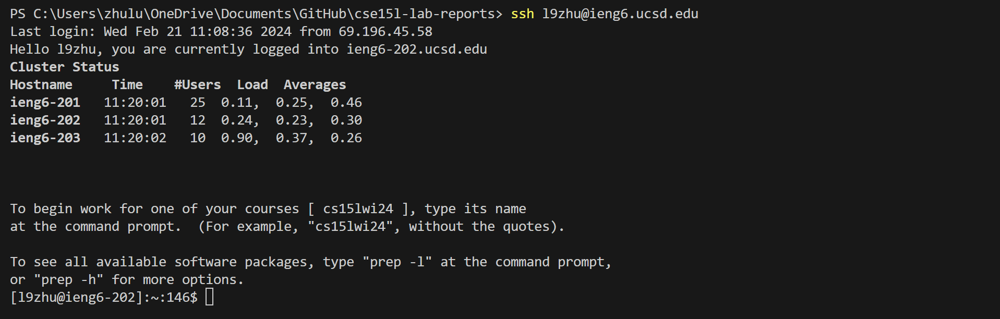
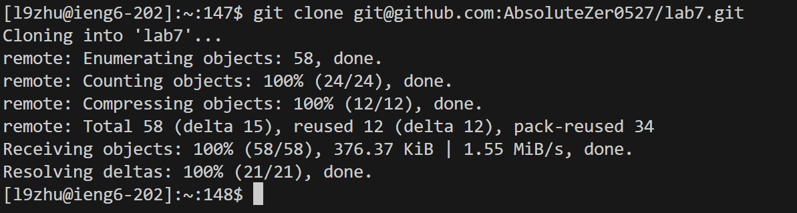
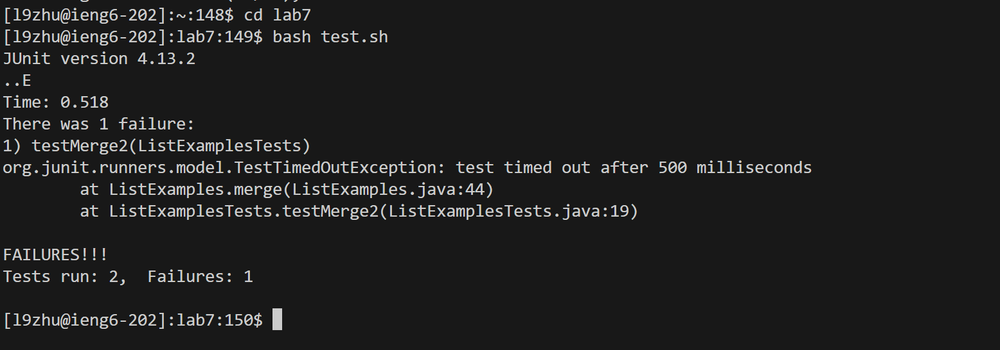
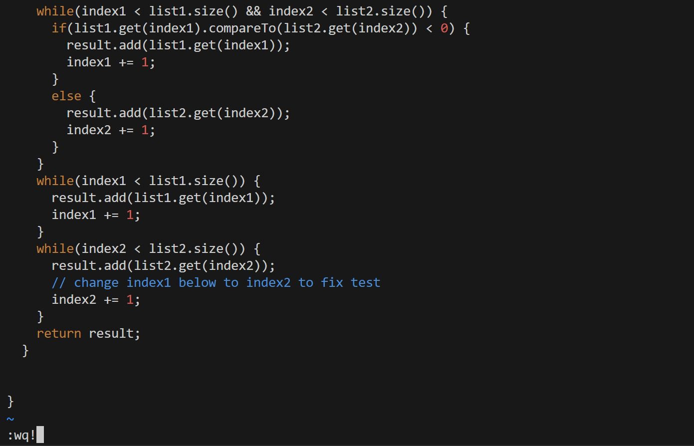
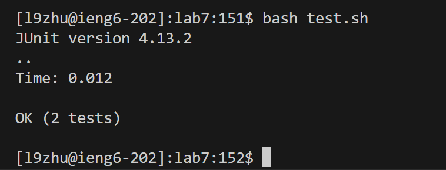
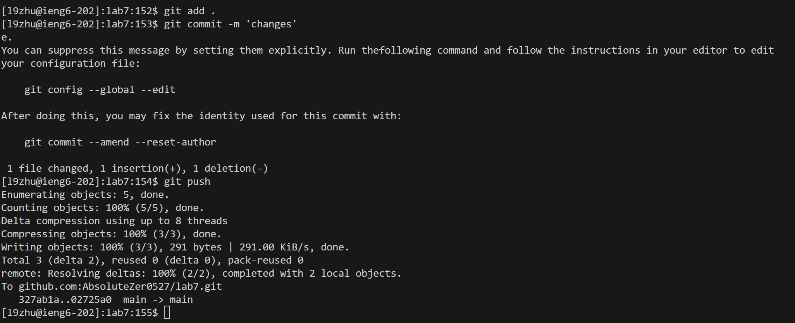

# Lab Report 3
### 4.Log into ieng6

Keys pressed: `<up><enter>` since it is the last command I used on my terminal, I'm able to access it quickly using the up-arrow key.

### 5.Clone your fork of the repository from your Github account (using the SSH URL)

Keys pressed: `git<space>clone<rightclick><enter>` I copied the repository ssh url into my clipboard, therefore I can paste it through rightclicking it.

### 6.Run the tests, demonstrating that they fail

Key pressed: `cd<space>lab7<enter>bash<space>test.sh<enter>`since the command is very high up in the bash history, I rather type it out again instead of using up and down arrow keys to search through it.

### 7.Edit the code file to fix the failing test

Key pressed: 
`vim<space>ListExamples.java<enter>`I enter vim to edit the ListExamples.java using the command`<rightarrow>i<backspace>2<esc>:wq!<enter>`I appear to be right in the error place, so I just simply move right one letter, enter insert mode, replace "1" with "2", at the end save and exit vim.

### 8.Run the tests, demonstrating that they now succeed

Key pressed: 
`<up><up><enter>` Since I just used `bash test.sh`I used the up arrow shortcut key to access it.

### 9.Commit and push the resulting change to your Github account (you can pick any commit message!)

Key pressed:
`git<space>add<space>.<enter>`I add all file content to the index,`git<space>commit<space>-m<space>'changes'<enter>` I try to avoid enter into vim by using the -m option to write the commit message, 
`git<space>push<enter>` and finally I push it to my repository, since origin main is set to default, I didn't specify it for time concern.