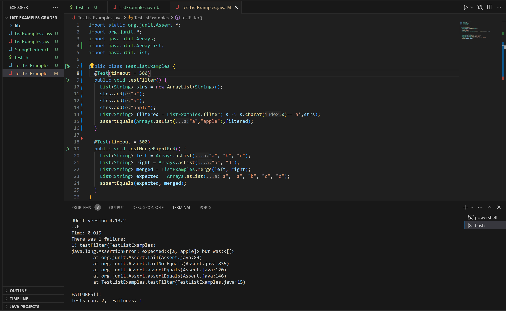
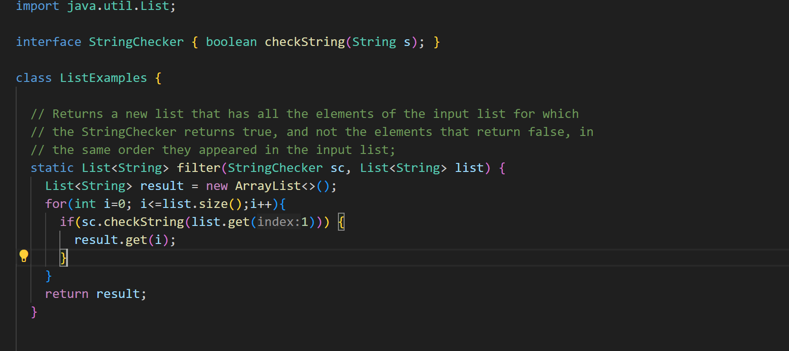
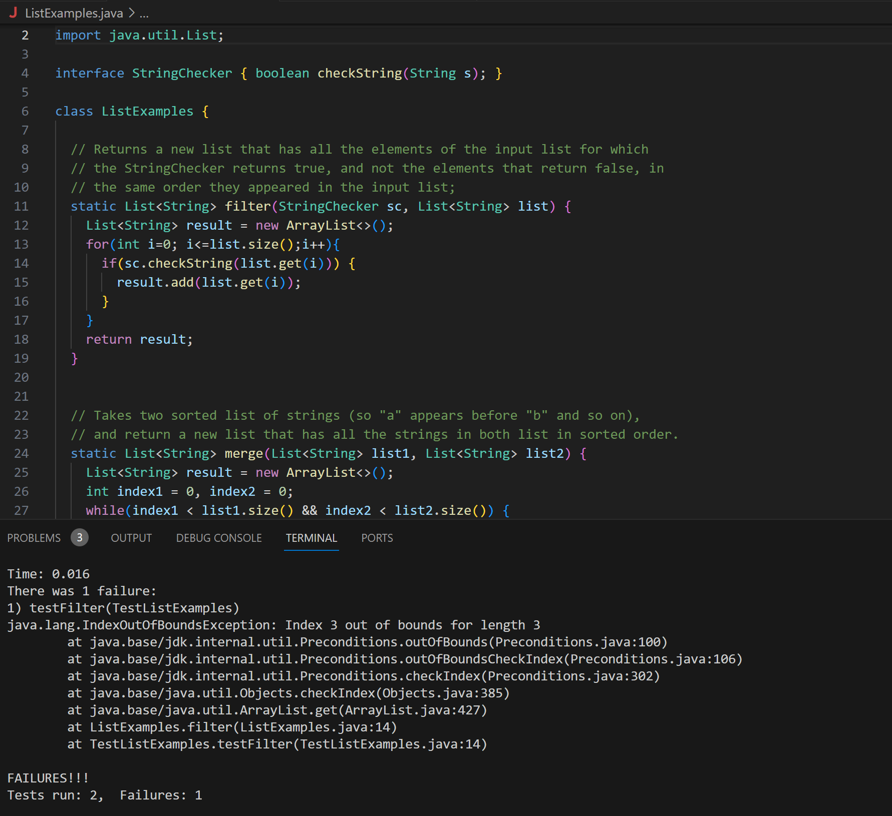
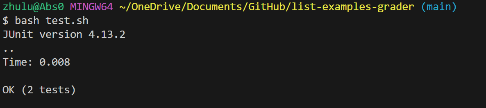

# Lab Report 4

## Part 1 - Debugging Scenario

> Student: Hello, based on my tests results, my filter method isn't working correctly. Here is the screenshot of the test results and my code for the filter method: 

>TA/Tutor: Based on the test output, which it displays as an empty Arraylist, it implies that your code does not add the elements into the ArrayList correctly. In your code, you should use `result.add(list.get(i));` instead. Try to replace the code and see how it works. Also the line above should be `get(i)` instead of `get(1)`, I assume it is a typo here.

>Student: Okay I made those changes. However the test still fail on my filter method. However this time it is an IndexOutOfBound error, so I think it has sometime to do with the size of the array. I'm confused because the length of the filtered out list should be less than or equal to the original list, how could it be out of bound?

>TA/Tutor: You are on the right track. There is actually a mistake in your for loop interation: it should be `i<list.size()` because the index starts from 0 and it can never be the same as the length of the list. Try to fix that and see how it goes.

>Student: Oh it works! Thanks! I actually made three mistakes in this method, which includes logic and syntax errors that ultimately caused the bug. I will try to more careful and make more tests when I'm programming to avoid those mistakes.

## Part 2 - Reflection
In the second half of this quarter, I really enjoy learning  more about making bash scripts, vim, jdb, and command in java...etc. For me, I feel like I'm really learning things that are useful and practical in my life. I remember trying to figure out git commands by myselfs before I took this course, it was a lot of struggle and confusion. After going over those in class, it makes a lot of more sense and I'm able to apply those skills into my projects and programming assignements.